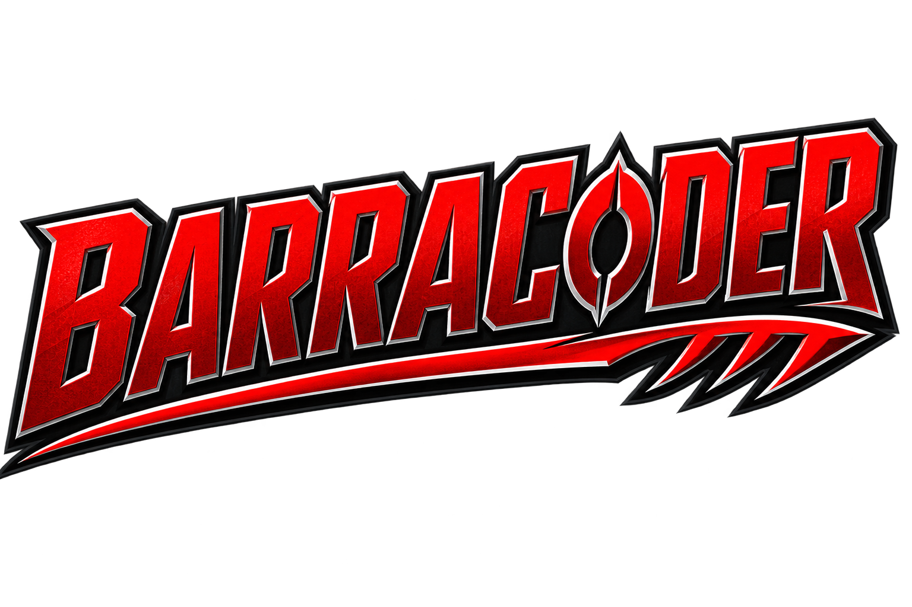

# Barracoder 🐟🤖

**FIRST® LEGO® League Challenge — BIOGLOW™ Founders Edition — 2026–27**

| | |
|---|---|
| **Team number** | 16651 |
| **Team name** | BarraCoders |
| **Organization** | Ealy Elementary School |
| **Location** | Whitehall, MI, USA |
| **Program** | FIRST LEGO League Challenge |
| **Season** | 2026–2027 · BIOGLOW™ Founders Edition |

> Team 16651 is the number the kids write on the scoresheet and give to referees
> and judges. It's on the site footer too, so it's readable on event day.

Team hub for the Barracoder team: season schedule, paperwork tracking, event prep,
and every official season document in one place.

**🌐 Team site (share this with teachers & volunteers):**
**[mirzaaamerali.github.io/barracoder](https://mirzaaamerali.github.io/barracoder/)** —
the full schedule plus a document library where every PDF opens right in the
browser. Notes and ideas live in [notes/](notes/).

## Key dates

| When | What |
|------|------|
| Tue & Thu, 6:00–7:30 pm | Team meetings |
| **Fri Oct 31, 2026** | All paperwork & completion documents done ([checklist](docs/DOCUMENTS.md)) |
| **Sun Nov 8, 2026** | **Scrimmage** — dry run of the main event ([readiness](docs/SCRIMMAGE.md)) |
| December 2026 (TBD) | Main festival |

## Start here

- **[SCHEDULE.md](SCHEDULE.md)** — every meeting from kickoff (Aug 11) through the
  season celebration (Dec 17): goals, 90-minute plan, and exit criteria per meeting.
- **[docs/DOCUMENTS.md](docs/DOCUMENTS.md)** — the paperwork checklist with due dates.
- **[docs/collaboration.md](docs/collaboration.md)** — how teachers and volunteers
  add notes and ideas without needing a GitHub account.
- **[docs/SCRIMMAGE.md](docs/SCRIMMAGE.md)** — the 9 reviewing criteria and the
  25-minute reviewing flow the team must be ready for on Nov 10.

## Official season materials

| Folder | Contents |
|--------|----------|
| [season/guides/](season/guides/) | Team Meeting Guide, **Robot Game Rulebook**, Engineering Notebook, season overview |
| [season/sessions/](season/sessions/) | Slide decks: intro + Sessions 1–12 |
| [season/robot-game/](season/robot-game/) | Mission-model build instructions (Books 1–13 + prepack + EOP), field setup guide, wireframe grid, guided-mission SPIKE program |
| [season/resources/](season/resources/) | Multimedia resources |
| [season/certificates/](season/certificates/) | Participation certificate templates |

The season in one line: build and code a **SPIKE Prime robot** to score
missions in **2.5-minute robot game matches**, develop an **innovation
project**, and present both to judges — robot game + judging both happen at
the Nov 8 scrimmage and the December festival.

> Note: `season/` previously held the FLL **Explore** packet (wrong division
> for this team) — those files live on in git history before 2026-08-11.

## Supplementary lessons

Team-written material that goes beyond the official season kit — not part of
the FIRST/LEGO curriculum, just extra practice.

- [lessons/pybricks-mission-manual.html](lessons/pybricks-mission-manual.html)
  — a seven-mission playbook that teaches real Python coding (Pybricks) on
  the SPIKE Prime hub, for kids who want to go past the block-based SPIKE app.
  Also linked from the team site's document library.

## Attribution

Materials under `season/` are © FIRST and the LEGO Group — see
[docs/sources.md](docs/sources.md) for official download links.

No student or family personal data belongs in this repo; the `.gitignore`
enforces the obvious cases (filled/signed forms, rosters).
